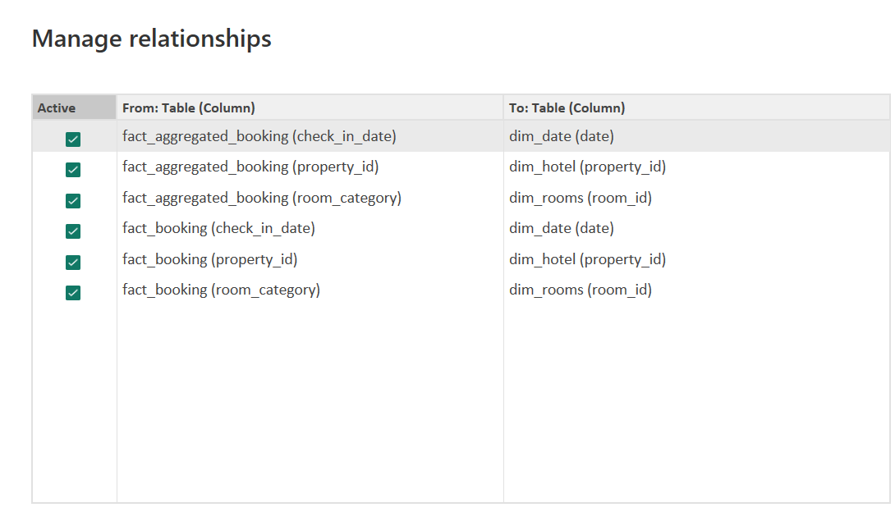
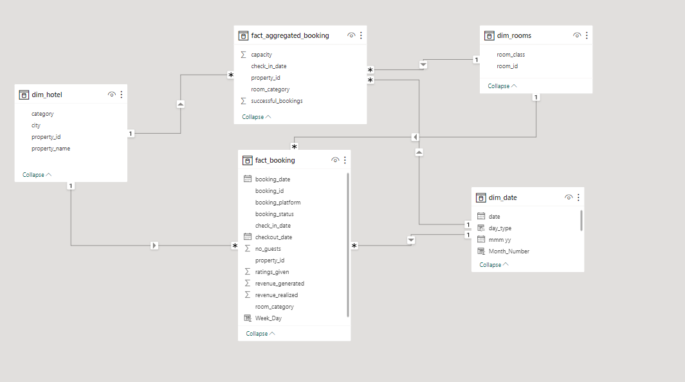
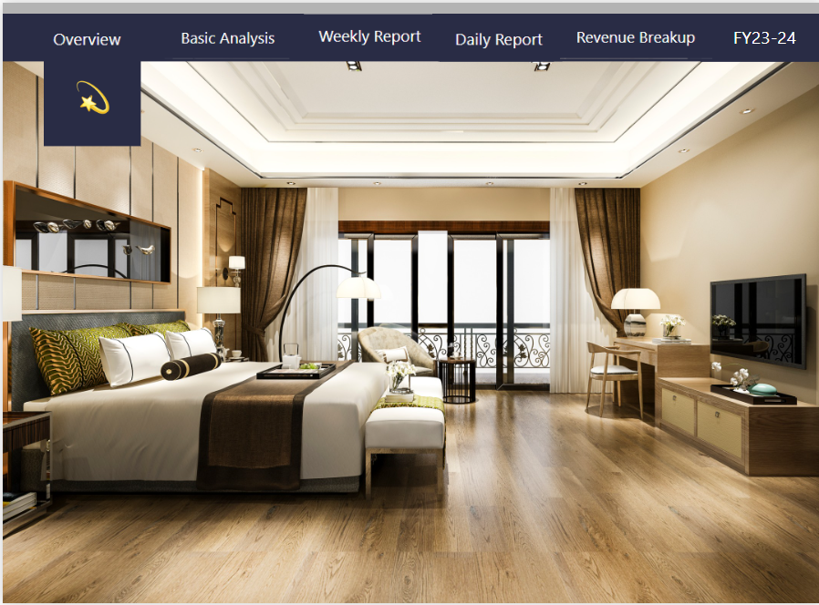
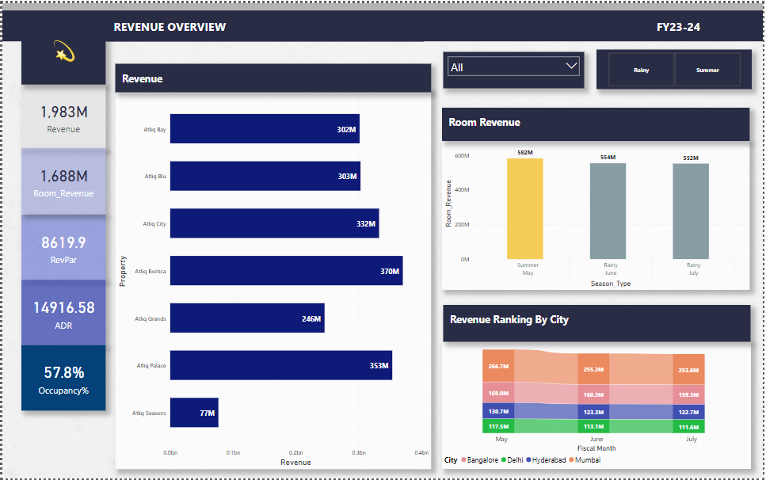
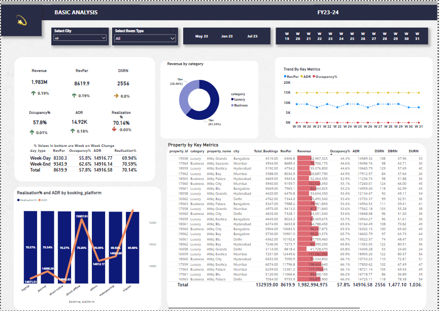
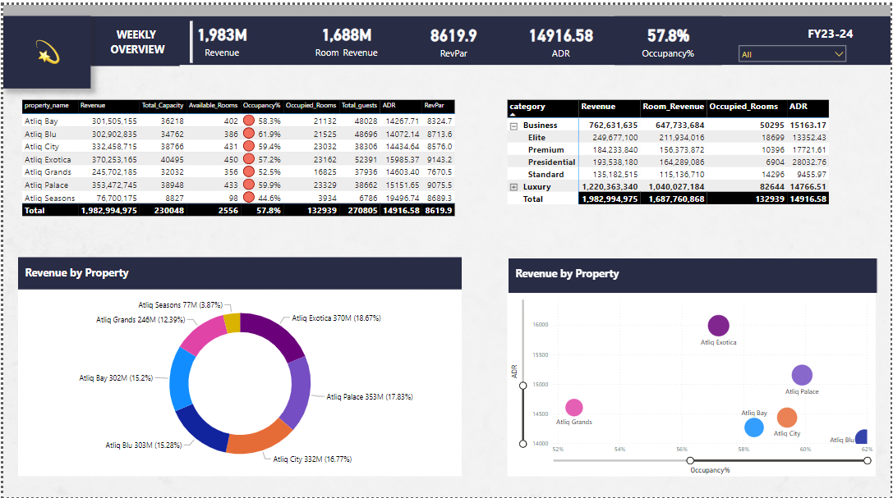
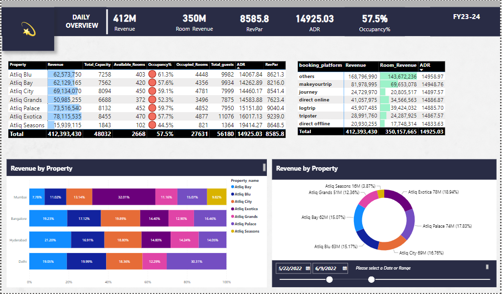
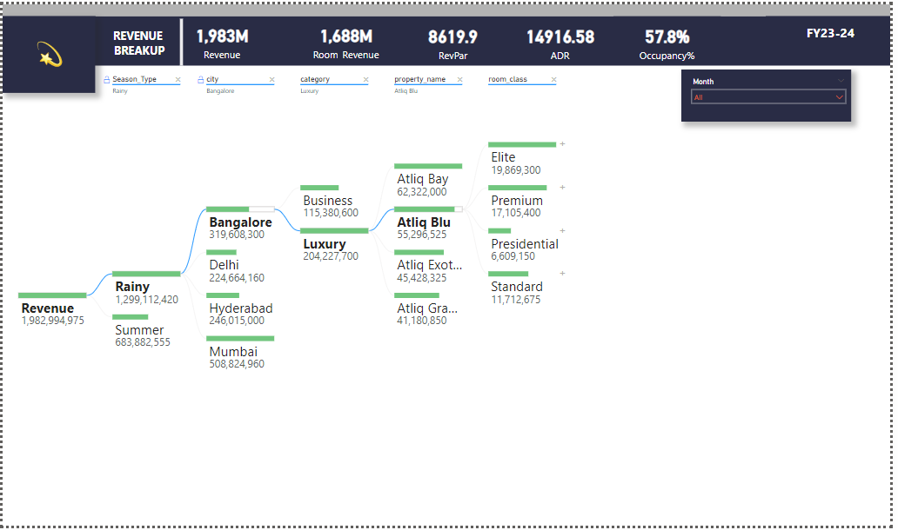

# Hospitality-Domain-Power-BI

## Introduction
 **AtliQ Grands** owns multiple five-star hotels across India. They have been in the hospitality industry for the past 20 years. Due to strategic moves from other competitors and ineffective decision-making in management, AtliQ Grands are losing its market share and revenue in the luxury/business hotels category. As a strategic move, the managing director of AtliQ Grands wanted to incorporate “Business and Data Intelligence” to regain their market share and revenue. However, they do not have an in-house data analytics team to provide them with these insights.

## Problem Statement
Create the metrics according to the metric list.
Create a dashboard according to the mock-up provided by stakeholders.
Create relevant insights that are not provided in the metric list/mock-up dashboard.

## Skills/Concepts Demonstrated

 The following Power BI features were incorporated:
- DAX
- Key Measures
- Page navigation
- Modelling
- ToolTip

## Data Modelling
 Power BI automatically connected related tables resulting in a **Star schema** model.fact_aggregated_booking and fact_booking are the fact tables of the model.The remaining 3 tables are dimensions tables:
1.	Dim_date
2.	Dim_rooms
3.	Dim_hotel
The relationship and Model is shown in the below screenshots:

Relationship                 | Data-Model
:---------------------------:|:----------------------:
 | 

## Data Source
Received the data from Code Basics, an online learning and teaching platform in Excel.

## Data Transformation/Cleaning
Imported the whole folder and once the folder gets transformed to Query Editor, need to duplicate the folder and expand the CSV file and rename the folders.
Generally in hotel industry, Friday and Saturday are considered as Weekends but in our table, weekends are Saturday and Sunday we need to change that.Also, need to remove the column day_type which is not useful, will create later on.
Updated the headers to a proper column name and changed the data type for date column from TEXT to DATE type.

## Visualizations
The report comprises of 6 page:
-	Home page
-	Overview
-	Basic Analysis
-	Weekly Overview
-	Daily Overview
-	Revenue Breakup

## Analysis  
#### Home page 
The Home page is the page where the user can navigate to and forth in the entire report by clicking on the navigation buttons which will navigate to that specific report page.  
  

#### Overview 
This page shows all the KPI values in a detailed tabular form. The data can be drilled down based in Months and Seasons (Rainy and Summer). The visuals on the page shows revenue share and occupancy by market segments.  

#### Basic Analysis 
The page shows the major 6 key metrics in one shot along with the movement on WoW change, for example we can see the .19% increase in revenue when compared to last week’s revenue. Also, we have enabled the Tool-Tip for all the 6 metrics where we can see the comparison between Week Day and Week End.  
We have made Week End and Week Day split for the Key Metric. When we go for the chart **‘Trend by Key Metrics’**, we can see the RevPAR is fluctuating which is a by-product of Rate and Occupancy. The chart says that the hotel does not use any Pricing strategy i.e., fixed pricing strategy than Dynamic pricing strategy. And when we see the data weekly, the occupancy% is fluctuating week on week and rates are not fluctuating at all.  
Now when we look the table **‘%Values in bottom are WoW change’** we can see that the Week Day and Week End RevPAR values are different because Occupancy% fluctuates and ADR is almost equal. The insight shows that the hotel has not only adopted Dynamic pricing but also lacking in the Week Day and Week End pricing, as the rates are marginally different.  
The tabular chart **‘Property by Key Metrics’** here when we look at the lowest Occupancy % value this gives an insight on How pricing influences Occupancy.When we drop the rate value we can see the occupancy gets increases and vice versa.So once occupancy % drops we have to check review ratings,the room type and also the cancellation % which is high when occupancy % drops. 
  

#### Weekly Overview 
Thie page shows the weekly performance of KPIs for all hotels. On top-right there is a detail view of KPI values by Category (Luxury, Business) and Room class (Elite, standard, presidential, premium) in a Matrix visual.  
The Donut chart at the bottom shows the total revenue by property name of the hotels.  
The Bubble chart shows the average daily rate and occupancy percentage by property name of the hotels, displaying a clearer view which hotel have high occupancy rate and upon ADR values.  
There is a week slicer on top header to filter out the report based on the selection.  
  

#### Daily Overview
The page shows the KPI values of all hotels in a Table Visual.The representation of KPI by different booking platforms is displayed in a Table Visual.  
Revenue by Property_name along with city is displayed in a different representation by using 100% Stacked bar chart.  
The Donut chart at the bottom shows the total revenue by property names on daily basis.  
The user can also select a date range or a single day to filter the data.  
  

#### Revenue Breakup  
This page in this report shows the revenue break-up by Property name, Month Name, Season type , Category (Luxury, Business) and Room class (Elite, standard, presidential, premium),City and their position can be changed according to the report user and it will give a dynamic insight over the revenue which is shown in a Decomposition Tree Visual.  
   

## Suggestion: 
The above information implies that there is a huge opportunity for this hotel, if they adopt Dynamic pricing and weekend and week day pricing strategy.
The hotel can also price high for the Luxury categories with Week end and Week Day pricing.
## Recommendation
For deep diving into the analytics,we need the previous year's data that will be required for the comparison and data driven decison making.

